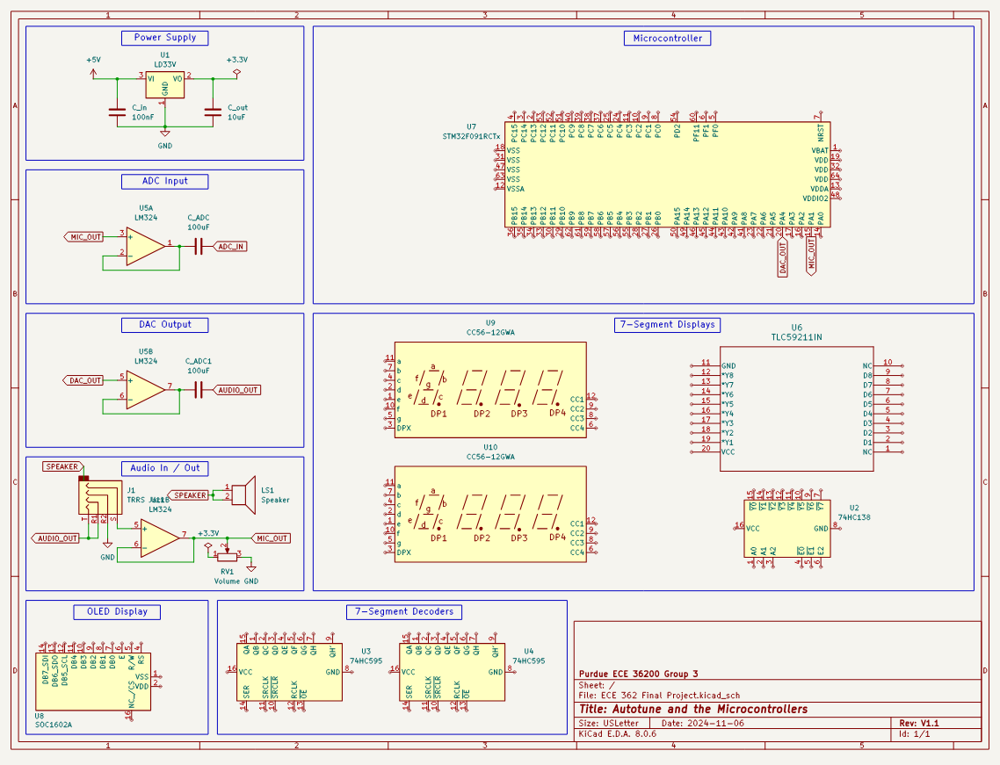

# Final Demo Video Link: https://youtube.com/shorts/DRTG0014v1s?feature=share

# ECE36200 Final Project - Autotune and the Microcontrollers

## Project Description
- Display the frequency of the input wave and output wave using the OLED display and SPI.
- Display the autotuned note using the 7-SEG display and SPI with DMA.
- Match the read data to the nearest musical note, and output the audio via the DAC.
- Read data from earbud microphone and convert data into a single sinusoidal wave using ADC.
- Additionally, keep latency within a reasonable amount such that the process is imperceptible or nearly.

## Schematic

## Main Features
Using the microphone on a pair of wired earbuds, we will input an audio signal (such as humming) into the ADC of the STM32. There, the microcontroller will find the nearest musical note (closest to the input frequency) and output that via the DAC to a speaker. We will also output frequency information on the OLED display, and note information on a 7-segment display.
- STM32 microcontroller
- Audio / headphone jack
- Wired headphones with mic
- Lab 4 DAC/ADC breadboard setup
- 7-segment displays
- OLED display

## External Interfaces
- SPI
- GPIO

## Internal Peripherals
- DMA
- ADC
- DAC
- SPI

