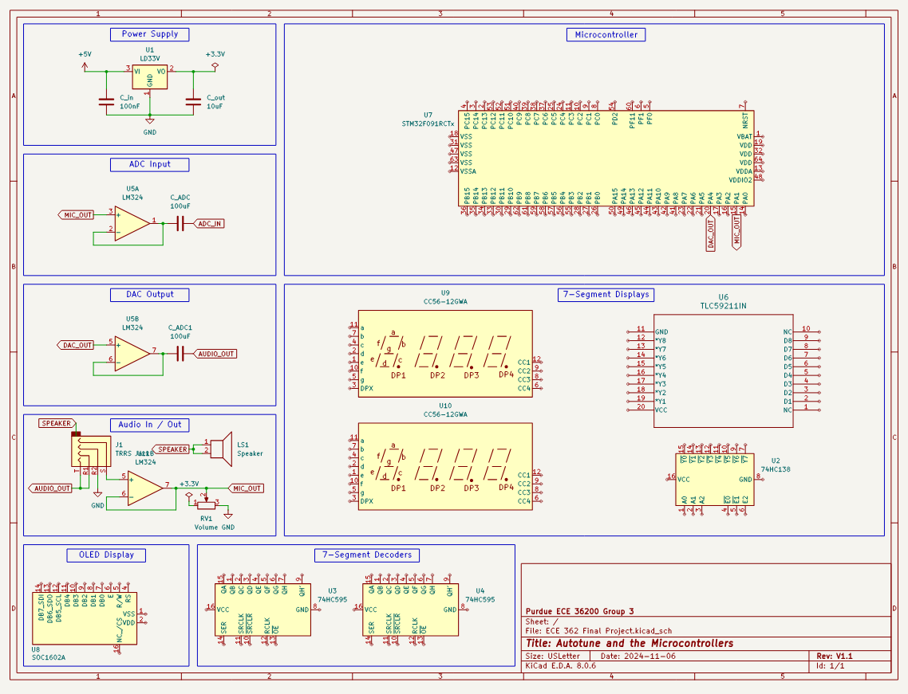

# ECE36200 Final Project - Autotune and the Microcontrollers (Group 3)

## Project Description
- Display the frequency of the input wave and output wave using the OLED display and SPI.
- Display the autotuned note using the 7-SEG display and SPI with DMA.
- Match the read data to the nearest musical note, and output the audio via the DAC.
- Read data from earbud microphone and convert data into a single sinusoidal wave using ADC.
- Additionally, keep latency within a reasonable amount such that the process is imperceptible or nearly.

## Schematic

## Main Features
Using the microphone on a pair of wired earbuds, we will input an audio signal (such as humming) into the ADC of the STM32. There, the microcontroller will find the nearest musical note (closest to the input frequency) and output that via the DAC to a speaker. We will also output frequency information on the OLED display, and note information on a 7-segment display.
- STM32 microcontroller
- Audio / headphone jack
- Wired headphones with mic
- Lab 4 DAC/ADC breadboard setup
- 7-segment displays
- OLED display

## External Interfaces
- SPI
- GPIO

## Internal Peripherals
- DMA
- ADC
- DAC
- SPI

## Timeline: 
### Before approval deadline (week 9):
- [x] Form team as early as possible
- [x] Brainstorm ideas by September 27th
- [x] Send idea for approval by September 27th

### Before demo deadline (week 14):
- [x] Design schematic by October 11th
- [x] Build breadboard (modify for mic input) by October 18th
- [x] Autotune algorithm by October 25th
- [x] Read data input via ADC by October 25th
- [ ] Output data via DAC by November 1st
- [x] Output frequency (input and output) information with OLED display by November 8th
- [x] Output note (output only) information on 7-SEG by November 8th
- [ ] Video / document / presentation by November 15th

### Demo week (week 14, Nov 19 - 22):
- [ ] Schedule demo by November 15th
- [ ] Demo project by November 22nd

## Related Projects: 
- [Metronome](https://nam04.safelinks.protection.outlook.com/?url=https%3A%2F%2Fwww.youtube.com%2Fwatch%3Fv%3DqFNAiyA_-Q0&data=05%7C02%7Cbkeever%40purdue.edu%7C7b866cc7897a4977b51b08dcdf1ba217%7C4130bd397c53419cb1e58758d6d63f21%7C0%7C0%7C638630556992924229%7CUnknown%7CTWFpbGZsb3d8eyJWIjoiMC4wLjAwMDAiLCJQIjoiV2luMzIiLCJBTiI6Ik1haWwiLCJXVCI6Mn0%3D%7C0%7C%7C%7C&sdata=N5QwyPY3uNe%2FPG4MGCbvO34jzF8bzl5aATO%2BmDM4ccE%3D&reserved=0)
- [Real-World Application](https://nam04.safelinks.protection.outlook.com/?url=https%3A%2F%2Fwww.soundonsound.com%2Freviews%2Fantares-atr1&data=05%7C02%7Cbkeever%40purdue.edu%7C7b866cc7897a4977b51b08dcdf1ba217%7C4130bd397c53419cb1e58758d6d63f21%7C0%7C0%7C638630556992937878%7CUnknown%7CTWFpbGZsb3d8eyJWIjoiMC4wLjAwMDAiLCJQIjoiV2luMzIiLCJBTiI6Ik1haWwiLCJXVCI6Mn0%3D%7C0%7C%7C%7C&sdata=SafxXDXVNp2qpLg%2BqPxMPD83C7znVLhkI%2FzG0qURYOA%3D&reserved=0)
- [A Possible Addition](https://nam04.safelinks.protection.outlook.com/?url=https%3A%2F%2Fgithub.com%2Fanweshct3%2FAudio-Spectrum-Analyzer-STM32&data=05%7C02%7Cbkeever%40purdue.edu%7C7b866cc7897a4977b51b08dcdf1ba217%7C4130bd397c53419cb1e58758d6d63f21%7C0%7C0%7C638630556992952030%7CUnknown%7CTWFpbGZsb3d8eyJWIjoiMC4wLjAwMDAiLCJQIjoiV2luMzIiLCJBTiI6Ik1haWwiLCJXVCI6Mn0%3D%7C0%7C%7C%7C&sdata=tgn4cyZhLdzFqLIUE1YPE2hP1MJYFtQsQDw3AQY82wQ%3D&reserved=0)
- [STM32 ADC/DAC Resource](https://nam04.safelinks.protection.outlook.com/?url=https%3A%2F%2Fwww.st.com%2Fresource%2Fen%2Fapplication_note%2Fan3126-audio-and-waveform-generation-using-the-dac-in-stm32-products-stmicroelectronics.pdf&data=05%7C02%7Cbkeever%40purdue.edu%7C7b866cc7897a4977b51b08dcdf1ba217%7C4130bd397c53419cb1e58758d6d63f21%7C0%7C0%7C638630556992963554%7CUnknown%7CTWFpbGZsb3d8eyJWIjoiMC4wLjAwMDAiLCJQIjoiV2luMzIiLCJBTiI6Ik1haWwiLCJXVCI6Mn0%3D%7C0%7C%7C%7C&sdata=2XxgrpP1QbLzHI1%2BshRpCTdmPZHYAS2qSvr5SRKHTIQ%3D&reserved=0)
